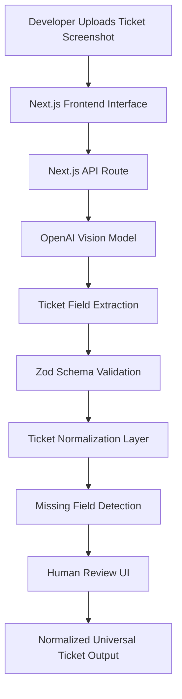

# Ticket Forge


AI-assisted developer tool that extracts structured tickets from screenshots (Jira, Azure DevOps, GitHub, etc.), validates them against schemas, and generates a clean, normalized ticket ready for development workflows.

Ticket Forge removes the friction of manually reading tickets from screenshots, Slack messages, or documentation by transforming them into structured and validated data automatically.

---

# Demo


---

# Overview

Developers frequently receive tickets through:

- screenshots  
- Slack messages  
- documentation  
- project management tools  

These inputs often contain incomplete or inconsistent information.

Ticket Forge uses **AI + schema validation** to:

1. Analyze ticket screenshots  
2. Extract structured fields  
3. Normalize values  
4. Detect missing critical information  
5. Present a review interface  
6. Generate a clean normalized ticket  

---

# System Architecture



---

# How The System Works

### 1. Screenshot Upload

The developer uploads a screenshot of a ticket from:

- Jira  
- Azure DevOps  
- GitHub Issues  
- documentation or Slack  

---

### 2. AI Vision Analysis

The screenshot is sent to an **OpenAI Vision model** which extracts:

- title  
- description  
- story points  
- priority  
- assignee  
- status  
- acceptance criteria  

The AI returns a **structured JSON response**.

---

### 3. Schema Validation

The response is validated using **Zod schemas** to ensure:

- required fields exist  
- types are correct  
- values match expected enums  

Invalid or missing fields are flagged.

---

### 4. Ticket Normalization

Raw AI outputs are normalized into consistent values.

Example:

| Raw Value | Normalized |
|-----------|------------|
| P1, Urgent, High | High |
| Closed, Done, Resolved | Done |

---

### 5. Missing Field Detection

Ticket Forge detects potential issues such as:

- story points not visible  
- acceptance criteria embedded in description  
- assignee unclear due to cropping  

These insights are shown to the user.

---

### 6. Human Review Interface

Before confirmation, the user can:

- edit fields  
- fix missing data  
- confirm the ticket  

This ensures **AI + human reliability**.

---

### 7. Final Normalized Ticket

The result is a standardized ticket structure ready to be used by APIs or other tools.

```ts
type UniversalTicket = {
  source: "jira" | "azure" | "github" | "unknown";
  ticketId?: string;
  title?: string;
  description?: string;
  priority?: string;
  storyPoints?: number;
  assignee?: string;
  status?: string;
  acceptanceCriteria?: string[];
};
```

---

# Features

### AI Ticket Extraction

Analyze screenshots and extract:

- title  
- description  
- priority  
- story points  
- assignee  
- status  
- acceptance criteria  

---

### Schema-Based Validation

All data is validated using **Zod schemas**.

Checks include:

- required fields  
- field types  
- valid enumerations  
- missing critical fields  

---

### Ticket Normalization

AI outputs are standardized into consistent values.

---

### Missing Field Detection

The system automatically identifies incomplete ticket information.

---

### Human-in-the-Loop Review

Users can review and edit extracted tickets before confirming.

---

# Tech Stack

Frontend

- Next.js  
- React  
- TypeScript  
- TailwindCSS  

AI

- OpenAI Vision Models  
- Structured JSON extraction  

Validation

- Zod schema validation  

Developer Tooling

- ESLint  
- TypeScript strict mode  

---

# Example Workflow

1️⃣ Upload ticket screenshot  

2️⃣ AI extracts ticket fields  

3️⃣ System validates extracted data  

4️⃣ Missing fields are detected  

5️⃣ User reviews ticket  

6️⃣ Final normalized ticket is generated  

---

# Example Output

```json
{
  "source": "jira",
  "ticketId": "PHARM-29512",
  "title": "Rename medication reminder creation flow",
  "priority": "High",
  "storyPoints": 5,
  "status": "In Progress"
}
```

---

# Running Locally

Clone the repository

git clone https://github.com/AdrianaAC/ticket-forge

Install dependencies

npm install

Run development server

npm run dev

Open the application

http://localhost:3000

---

# Project Status

Ticket Forge is currently under active development.

Planned improvements:

- multi-image ticket analysis  
- acceptance criteria extraction  
- Jira API integration  
- GitHub issue generation  
- AI confidence scoring  
- batch ticket processing  

---

# Why This Project Exists

Developers constantly deal with poorly structured ticket information.

Ticket Forge aims to:

- reduce manual interpretation  
- improve ticket quality  
- accelerate developer workflows  
- demonstrate AI-enabled frontend architecture  

---

# Author

Adriana Alves  

Frontend Developer focused on AI-enabled developer tools and modern frontend architectures.

GitHub  
https://github.com/AdrianaAC

LinkedIn  
https://linkedin.com/in/adrianaalves098

---

⭐ If you find this project interesting, consider starring the repository.
